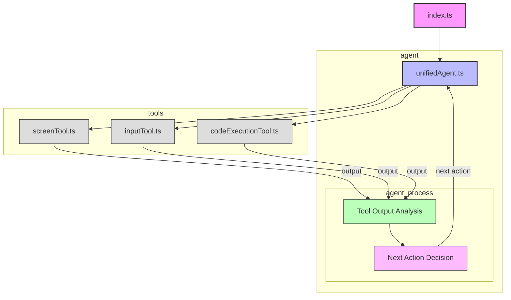

```mermaid
flowchart TD
    index["index.ts"]
    
    subgraph "agent"
        unifiedAgent["unifiedAgent.ts"]
        subgraph "agent_process"
            toolAnalysis["Tool Output Analysis"]
            actionDecision["Next Action Decision"]
        end
    end
    
    subgraph "tools"
        screenTool["screenTool.ts"]
        inputTool["inputTool.ts"]
        codeTool["codeExecutionTool.ts"]
    end
    
    index --> unifiedAgent
    
    %% Tool interaction flow
    unifiedAgent --> screenTool
    unifiedAgent --> inputTool
    unifiedAgent --> codeTool
    
    %% Tool output processing
    screenTool -- "output" --> toolAnalysis
    inputTool -- "output" --> toolAnalysis
    codeTool -- "output" --> toolAnalysis
    
    %% Action decision flow
    toolAnalysis --> actionDecision
    actionDecision -- "next action" --> unifiedAgent
    
    %% Main components
    style index fill:#f9f,stroke:#333,stroke-width:2px
    
    %% Agent and process
    style unifiedAgent fill:#bbf,stroke:#333,stroke-width:2px
    style toolAnalysis fill:#bfb,stroke:#333,stroke-width:1px
    style actionDecision fill:#fbf,stroke:#333,stroke-width:1px
    
    %% Tools
    style screenTool fill:#ddd,stroke:#333,stroke-width:1px
    style inputTool fill:#ddd,stroke:#333,stroke-width:1px
    style codeTool fill:#ddd,stroke:#333,stroke-width:1px
```