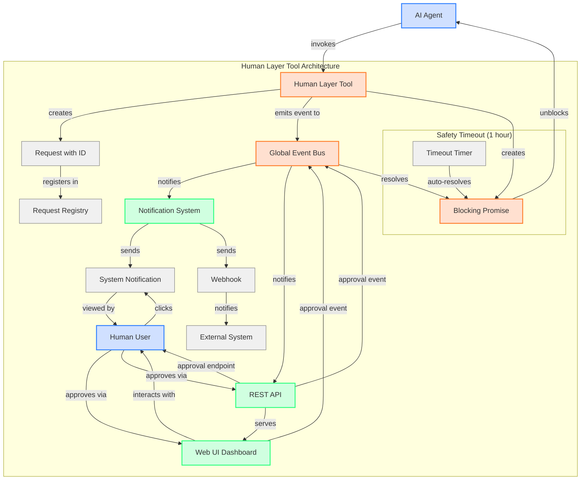

# Human Layer Tool: Architecture and Design

## Overview

The Human Layer Tool provides a mechanism for AI agents to request human intervention during automated tasks. It implements a true blocking pattern that pauses execution until a user explicitly approves continuation, with support for system notifications, external webhooks, and a safety timeout mechanism.

## Core Components

### 1. Event-Based Architecture

The system uses a decoupled event-based architecture with two primary event mechanisms:

- **Internal Event Emitter**: For handling the promise resolution and request lifecycle
- **Global Event Bus**: For cross-module communication without circular dependencies

### 2. Request Lifecycle

Each human intervention request follows a defined lifecycle:

1. **Creation**: Request created with unique ID, title, reason, and timeout
2. **Notification**: System notification and optional webhook notifications sent
3. **Waiting**: Execution blocked by unresolved Promise
4. **Resolution**: Request is either approved or times out
5. **Cleanup**: Request removed from active requests registry

### 3. Integration Points

The system provides multiple integration points:

- **System Notifications**: Desktop notifications using node-notifier
- **Webhook Integration**: HTTP notifications to external systems
- **Web UI Dashboard**: Display of pending requests via HTTP API
- **REST API**: Endpoints to view and approve requests

## Decoupled Communication Pattern

The key architectural improvement is the use of a global event bus pattern for cross-module communication:

This approach solves several key problems:

1. **Circular Dependencies**: Avoids module import cycles between tool and server components
2. **Hard-coded Paths**: Removes reliance on hard-coded relative paths
3. **Tight Coupling**: Decouples the tool from specific implementation details
4. **Testability**: Makes it easier to test components in isolation

## Human Interaction Flow

1. **AI Agent Detects Need**: AI recognizes it needs human assistance (captcha, login, etc.)
2. **Tool Invocation**: `humanLayerTool` is invoked with title and reason
3. **Request Registration**: Request is added to active requests registry
4. **Notifications**: System notification appears and webhooks are triggered
5. **UI Dashboard Updates**: User can check for pending requests through the dashboard
6. **Execution Blocks**: AI execution is paused at the Promise
7. **Human Response**: User clicks notification or approves via UI/API
8. **Resolution**: Promise resolves, execution continues
9. **Automatic Timeout**: If no response after 1 hour, request times out and execution continues

## Safety Mechanisms

- **Mandatory Timeout**: Every request has a 1-hour timeout to prevent indefinite blocking
- **Request Registry**: All pending requests are tracked in a central registry
- **Status Transitions**: Clear status transitions (pending � approved/timed_out)
- **Clean Cleanup**: Requests are removed from registry after completion

## UI Integration

The tool integrates with a real-time dashboard showing:

- All pending human intervention requests
- Request details (title, reason, creation time)
- Time remaining before timeout
- Approval/rejection controls
- Historical request log

## Advantages Over Previous Implementation

1. **True Blocking**: Execution genuinely stops until explicitly unblocked
2. **Multiple Notification Channels**: Desktop, web UI, and webhook notifications
3. **Configurable Timeout**: Automatic continuation after configured timeout period
4. **Clean Architecture**: Decoupled components with event-based communication
5. **Status Tracking**: All requests tracked with clear lifecycle
6. **No Required Paths**: Avoids hard-coded paths or global variables